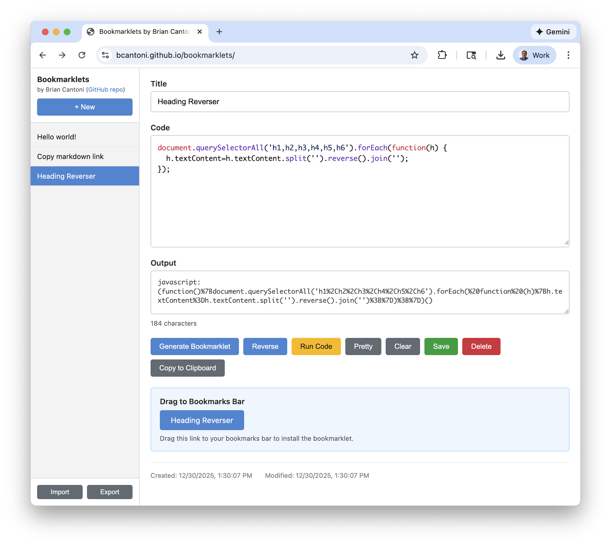

# Bookmarklets

A simple web application for creating, editing, and managing browser bookmarklets.

**Live site:** <https://bcantoni.github.io/bookmarklets/>

**Blog post:** <https://www.cantoni.org/2025/12/30/modern-browser-bookmarklets/>

## Features

- **Create & Edit Bookmarklets** - Write JavaScript code and convert it to bookmarklet format
- **Reverse Engineering** - Paste any bookmarklet to decode it back to readable JavaScript
- **Code Formatting** - Built-in prettifier to clean up your code
- **Test In-Browser** - Run your bookmarklet directly in the current page
- **Local Storage** - All bookmarklets are saved in your browser's local storage
- **Import/Export** - Backup and restore your collection as JSON
- **Drag & Drop Install** - Drag the generated link directly to your bookmarks bar

## How It Works

The bookmarklet conversion process:

1. Minifies the JavaScript code (preserving strings)
2. Wraps it in an IIFE (Immediately Invoked Function Expression) to isolate scope
3. URL encodes the result
4. Adds the `javascript:` prefix

## Built With

- Single HTML file with embedded CSS and JavaScript
- Vanilla JavaScript (no frameworks)
- [Highlight.js](https://highlightjs.org/) for syntax highlighting
- [js-beautify](https://beautifier.io/) for code formatting
- Browser localStorage for persistence
- Hosted on GitHub Pages

## License

MIT License

## Development

This project was built with assistance from [Claude Code](https://claude.ai/code).
